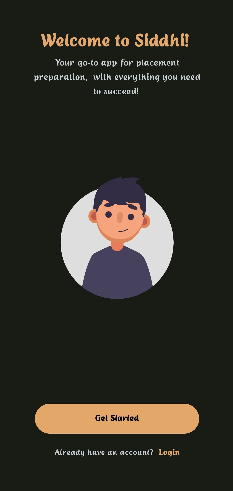
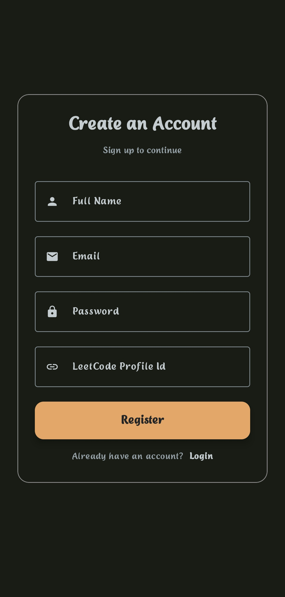
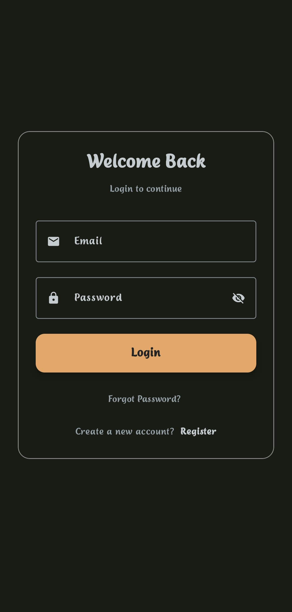
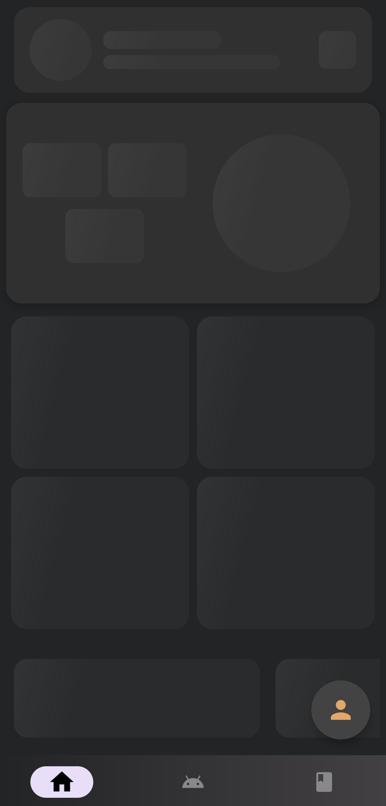
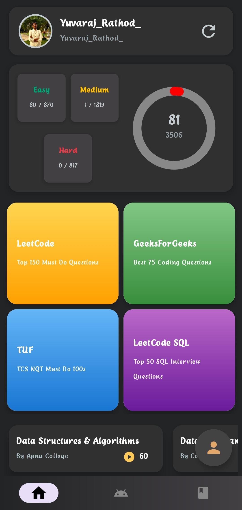
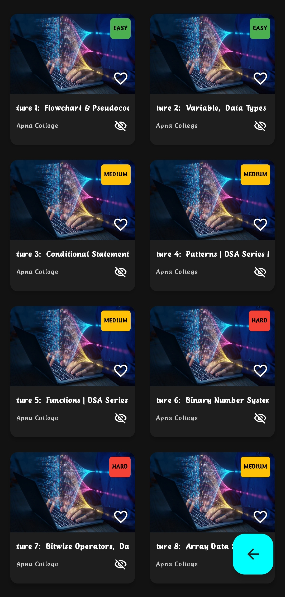
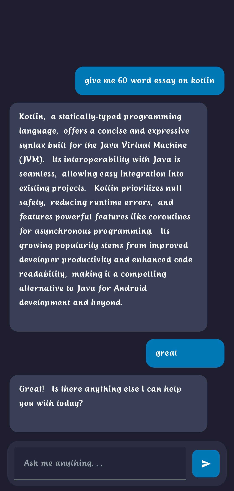

# Siddhi Placement Prep

Siddhi Placement Prep is an EdTech Android application designed to help students prepare for placements with high-quality learning resources. The app provides structured courses, video playlists, and interactive features to enhance the learning experience.

## 🚀 Features

- 📚 Curated playlists for DBMS, DSA, OS, and more.
- 🎥 Video lectures from top educators.
- 🌙 Dark mode UI for a professional and polished experience.
- ⭐ Favorite and watched video tracking.
- 🔥 Firebase integration for remote updates.
- 🎬 Seamless YouTube video playback.

## 📸 Screenshots

   

   

   

   

## 🛠 Tech Stack

- **Kotlin** (Jetpack Compose)
- **Firebase** (Remote Config, Firestore)
- **Jetpack Libraries** (Navigation, Hilt, Room)
- **YouTube Player API** for seamless video playback
- **Material Design 3** for a modern UI/UX
